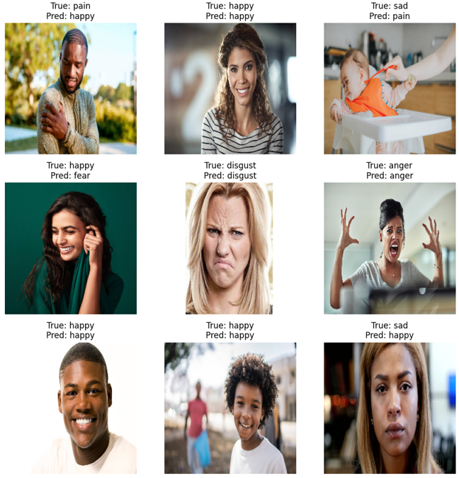
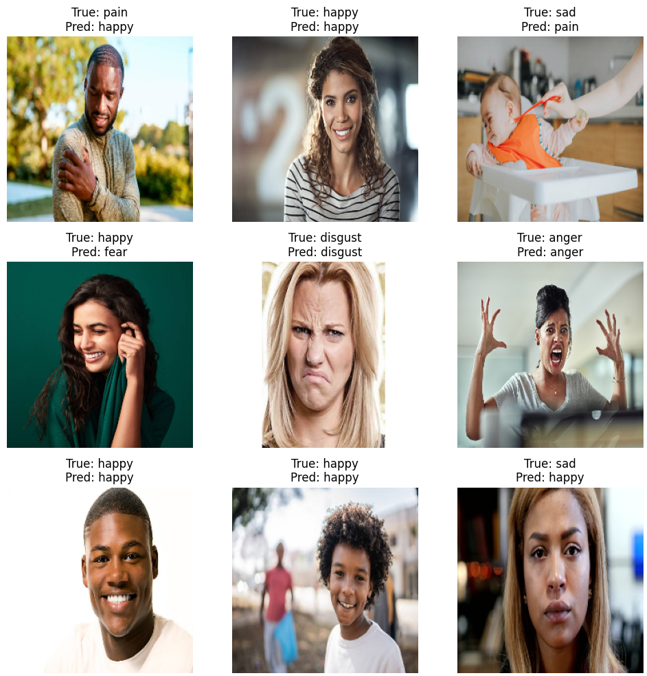
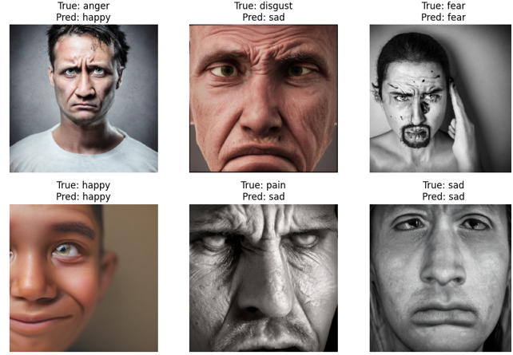
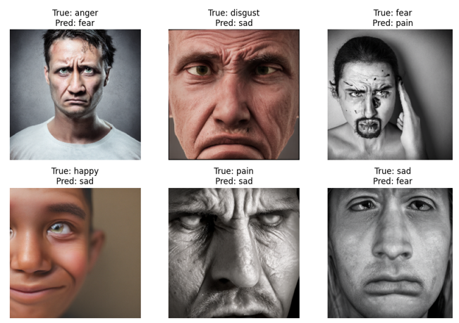

# Human Facial Expression Classification Using CNN-Based Deep Learning Models

Classifying human facial emotions (anger, disgust, fear, happy, pain, sad) using a custom CNN and transfer learning (MobileNetV2), with diffusion-generated synthetic images used to probe the effect of augmented data on model performance.

## Overview

This project explores facial emotion recognition using convolutional neural networks. Two modelling approaches are trained and compared:

- A **custom CNN** built and tuned from scratch
- A **transfer learning model** based on **MobileNetV2**

A Stable Diffusion pipeline is additionally used to synthesize extra facial images per emotion class, allowing a comparison of model performance on real vs. synthetically-augmented data.

## Repository Structure

```
facial-emotion-cnn/
├── README.md
├── LICENSE
├── .gitignore
├── requirements.txt
├── Model_train.ipynb                       # Preprocessing, training, evaluation, visualization
├── 6 Emotions for image classification/    # Cleaned dataset (from Kaggle)
└── synthetic_faces_all_six/                # Diffusion-generated synthetic images
```

## Dataset

- **Source:** [6 Human Emotions for Image Classification](https://www.kaggle.com/datasets/yousefmohamed20/sentiment-images-classifier/data) (Kaggle)
- **Size:** 1,146 images across 6 emotion classes (anger, disgust, fear, happy, pain, sad)
- Class sizes are naturally imbalanced (e.g. ~230 "happy" images vs. ~162 "pain" images)
- Images vary in background, lighting, and face orientation

A cleaned copy of the dataset is included under `6 Emotions for image classification/`. Before committing it, double-check the license/terms on the Kaggle dataset page to confirm redistribution is permitted — if it isn't, keep the folder out of version control (see `.gitignore`) and link to the source instead.

`base_path` and `synthetic_path` in the notebook are set as relative paths (`"6 Emotions for image classification"` and `"synthetic_faces_all_six"`), so the notebook should be run from the repository root.

## Methodology

### 1. Data Preprocessing
- Images loaded and labelled by folder name
- Stratified split: 80% training / 10% validation / 10% test
- Resized to 224×224, normalized to [0, 1]
- Converted to NumPy arrays; labels one-hot encoded

### 2. Custom CNN Architecture
A hierarchical feature extractor: three Conv2D + MaxPooling blocks (32 → 64 → 128 filters) with BatchNormalization and increasing Dropout (0.3 → 0.4 → 0.5), followed by a Flatten → Dense(128) → Dense(6, softmax) classification head.

### 3. Transfer Learning
MobileNetV2 is used as a pretrained backbone for comparison against the custom CNN.

### 4. Training Setup
- EarlyStopping (patience 8, restores best weights)
- ReduceLROnPlateau (halves LR after 3 stagnant epochs, floor at 1e-6)
- Data augmentation: rotation, width/height shift, zoom, horizontal flip
- Up to 50 epochs, batch size 32

### 5. Synthetic Data Generation
A Stable Diffusion pipeline (via `diffusers`/PyTorch) is used to generate additional synthetic facial images per emotion class (see `synthetic_faces_all_six/`), used to evaluate whether synthetic augmentation improves generalization.

## Results Summary

- Custom CNN: training accuracy reached ~75–80% with steadily decreasing training loss, but validation accuracy plateaued around 35–40%, indicating overfitting.
- MobileNetV2 (transfer learning) showed better and more stable learning behaviour than the custom CNN on both accuracy and loss.
- Prediction spot-checks showed comparable performance between the two approaches on the sampled test cases (5/9 correct each).

<br>

<div align="center">
  
  <p><em>Example: Transfer learning compare with dataset.</em></p>
</div>

<br>

<div align="center">
  
  <p><em>Example: Custom CNN compare with dataset.</em></p>
</div>

<br>

<div align="center">
  
  <p><em>Example: Transfer learning compare with GAN generated image.</em></p>
</div>

<br>

<div align="center">
  
  <p><em>Example: Custom CNN compare with GAN generated image.</em></p>
</div>

<br>

## Limitations

- Small, class-imbalanced dataset (1,146 images across 6 classes)
- Some label noise/bias in source images
- Overfitting persisted despite early stopping, LR scheduling, and augmentation

## Future Work

- Broader transfer learning experimentation and hyperparameter tuning
- Larger and more diverse datasets
- Expanded synthetic-image augmentation to address class imbalance

## Ethical Considerations

This project uses real human face images. Facial data is sensitive: it should only be sourced from datasets with clear usage permissions, stored securely, and not repurposed beyond research use. Synthetic faces included in this repo are diffusion-generated and shared for research reproducibility only — they do not depict real individuals.

## Setup

```bash
pip install -r requirements.txt
```

Then open `Model_train.ipynb` in Jupyter (from the repository root) to reproduce preprocessing, training, and evaluation. Note: the Stable Diffusion image-generation step benefits significantly from a GPU.

## License

Code in this repository is licensed under the [MIT License](LICENSE). The dataset used is subject to its own license on Kaggle — see the link above.

## Citation

If you use this work, please cite the original dataset:
> 6 Human Emotions for Image Classification, Kaggle. https://www.kaggle.com/datasets/yousefmohamed20/sentiment-images-classifier/data

